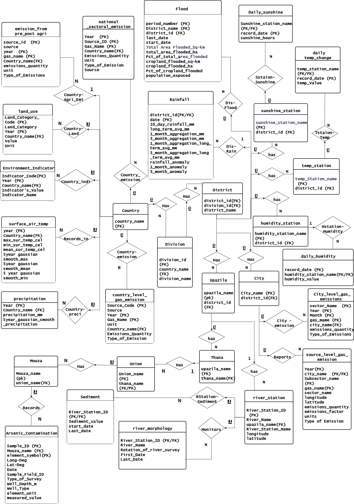

# Environmental Database for Bangladesh

## Overview

This project develops a relational database for storing, managing, and integrating environmental data from Bangladesh.

The database includes data related to climate, rainfall, precipitation, floods, rivers, water quality, land use, pollution, environmental indicators, and greenhouse gas emissions. The datasets were collected from multiple sources, processed, and integrated into a centralized MySQL database.

---

## Objectives

- Organize environmental datasets of Bangladesh.
- Design a relational database using an Entity-Relationship (ER) model.
- Establish relationships between geographical and environmental data.
- Maintain data integrity using primary and foreign keys.
- Clean and transform datasets for database integration.
- Automate data loading using Python-based ETL processes.

---

## ER Diagram

The database structure was designed using an Entity-Relationship (ER) Diagram that defines the major entities and relationships within the system.



---

## Database

**Database Name:** `environment_bd`

The database contains **29 tables** covering geographical, climate, flood, river, water quality, pollution, land use, environmental indicator, and greenhouse gas emission data.

The database schema is available in:

```text
SQL/environment_bd_schema.sql
